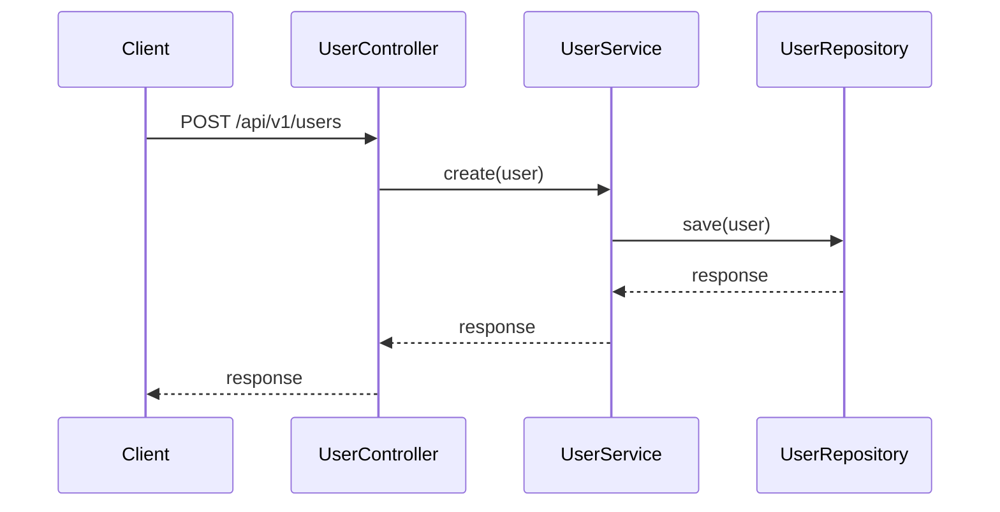
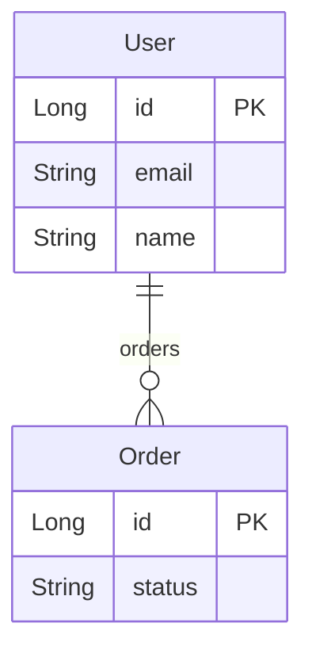

# JDocusaurus

[](https://github.com/aocdev/JDocusaurus/actions/workflows/ci.yml)
[](https://opensource.org/licenses/Apache-2.0)
[](https://adoptium.net/)

A Java library for generating deep microservice documentation in [Docusaurus](https://docusaurus.io/) format, using annotations and compile-time processing (APT).

Annotate your code with `@JDoc*` and automatically get: Markdown pages with endpoints, Mermaid sequence diagrams, ER diagrams, event maps, business rules, external integrations, configuration, and a ready-to-publish Docusaurus structure.

## Features

- **Zero runtime** - Annotation processing only at compile time (`RetentionPolicy.SOURCE`)
- **No reflection** - Works with plain Java, no Spring or frameworks required
- **Automatic Mermaid diagrams**: sequence, ER, events, dependencies
- **Automatic flow detection** via static analysis with JavaParser
- **Hybrid JPA reading** - Enriches entities with JPA metadata without direct dependency
- **Full Docusaurus structure** - `index.md`, `sidebars.js`, frontmatter with `sidebar_label` and `sidebar_position`
- **Configurable** via compiler options (`-Ajdoc.*`)

## Requirements

- Java 21+
- Maven 3.8+ (included via [Maven Wrapper](https://maven.apache.org/wrapper/) — no installation needed)

## Installation

Add the dependencies to your `pom.xml`:

```xml
<dependencies>
    <dependency>
        <groupId>org.aocdev</groupId>
        <artifactId>jdocusaurus-annotations</artifactId>
        <version>1.0-SNAPSHOT</version>
        <scope>provided</scope>
    </dependency>
    <dependency>
        <groupId>org.aocdev</groupId>
        <artifactId>jdocusaurus-processor</artifactId>
        <version>1.0-SNAPSHOT</version>
        <scope>provided</scope>
    </dependency>
</dependencies>
```

Optionally configure the processor options:

```xml
<build>
    <plugins>
        <plugin>
            <groupId>org.apache.maven.plugins</groupId>
            <artifactId>maven-compiler-plugin</artifactId>
            <version>3.13.0</version>
            <configuration>
                <compilerArgs>
                    <arg>-Ajdoc.projectName=User Service</arg>
                    <arg>-Ajdoc.projectDescription=User management microservice</arg>
                    <arg>-Ajdoc.fullStructure=true</arg>
                </compilerArgs>
            </configuration>
        </plugin>
    </plugins>
</build>
```

## Quick Start

### 1. Annotate a controller

```java
@JDocClass(
    name = "User Controller",
    description = "Controller for user management",
    basePath = "/api/v1/users",
    version = "v1"
)
public class UserController {

    @JDocEndpoint(
        method = HttpMethod.GET,
        path = "/{id}",
        description = "Gets a user by ID",
        summary = "Get user"
    )
    @JDocResponse(code = 200, description = "User found")
    @JDocResponse(code = 404, description = "User not found")
    public Object getUserById(
            @JDocParam(
                name = "id",
                description = "User identifier",
                location = ParamLocation.PATH,
                example = "123"
            ) Long id
    ) {
        return userService.findById(id);
    }
}
```

### 2. Compile

```bash
./mvnw clean compile
```

### 3. Result

```
JDocusaurus: generados 16 ficheros (1 clases, 5 endpoints, 5 diagramas, ...)
```

Markdown files are generated in `target/classes/docs/` (default path).

## Annotations

### REST API

| Annotation      | Target      | Description                             |
|-----------------|-------------|-----------------------------------------|
| `@JDocClass`    | `TYPE`      | Documents an API controller/class       |
| `@JDocEndpoint` | `METHOD`    | Documents an HTTP endpoint              |
| `@JDocParam`    | `PARAMETER` | Documents an endpoint parameter         |
| `@JDocResponse` | `METHOD`    | Documents an HTTP response (repeatable) |
| `@JDocHeader`   | `METHOD`    | Documents an HTTP header (repeatable)   |

```java
@JDocClass(name = "User Controller", description = "...", basePath = "/api/v1/users")
public class UserController {

    @JDocEndpoint(method = HttpMethod.POST, path = "/", description = "Creates a user", auth = "Bearer JWT")
    @JDocResponse(code = 201, description = "Created")
    @JDocResponse(code = 400, description = "Invalid data")
    @JDocHeader(name = "Authorization", description = "JWT Token")
    public Object create(@JDocParam(description = "User data", location = ParamLocation.BODY) Object user) {
        // ...
    }
}
```

### Flows and Sequence Diagrams

| Annotation         | Target           | Description                                 |
|--------------------|------------------|---------------------------------------------|
| `@JDocFlow`        | `TYPE`, `METHOD` | Declares a business flow                    |
| `@JDocFlowStep`    | `METHOD`         | Defines a step within a flow (repeatable)   |
| `@JDocParticipant` | `TYPE`           | Declares a participant in sequence diagrams |

Sequence diagrams are generated in two ways:

**Manual** - With `@JDocFlowStep`:

```java
@JDocFlow(name = "user-registration", title = "User Registration", description = "Registration flow")
public class UserController {

    @JDocFlowStep(flow = "user-registration", order = 1, from = "Client", to = "Controller", message = "POST /users")
    @JDocFlowStep(flow = "user-registration", order = 2, from = "Controller", to = "Service", message = "create(user)")
    @JDocFlowStep(flow = "user-registration", order = 3, from = "Service", to = "DB", message = "save(user)", returnMessage = "savedUser")
    public Object createUser(Object user) { ... }
}
```

**Automatic** - JavaParser analyzes the source code and detects method calls on injected fields, generating the diagram automatically (recursive, with conditional branch detection).

Mermaid output:



### Data Model

| Annotation      | Target  | Description                               |
|-----------------|---------|-------------------------------------------|
| `@JDocEntity`   | `TYPE`  | Documents a data entity                   |
| `@JDocField`    | `FIELD` | Documents an entity field                 |
| `@JDocRelation` | `FIELD` | Documents a relationship between entities |

If the entity has JPA annotations (`@Entity`, `@Column`, `@Id`, `@OneToMany`...), JDocusaurus reads them as fallback without requiring JPA as a dependency. `@JDoc*` annotations always take priority.

```java
@JDocEntity(name = "User", description = "Registered user in the system", table = "users")
public class UserEntity {

    @JDocField(description = "Unique identifier", nullable = false, constraints = "PK, AUTO_INCREMENT")
    private Long id;

    @JDocField(description = "User email", example = "john@example.com", nullable = false, constraints = "UNIQUE")
    private String email;

    @JDocRelation(target = "Order", type = RelationType.ONE_TO_MANY, description = "User orders")
    private List<Order> orders;
}
```

Generates a Mermaid ER diagram:



### Events and Messaging

| Annotation      | Target           | Description                          |
|-----------------|------------------|--------------------------------------|
| `@JDocEvent`    | `TYPE`           | Declares a domain event              |
| `@JDocProduces` | `METHOD`, `TYPE` | Marks an event producer (repeatable) |
| `@JDocConsumes` | `METHOD`, `TYPE` | Marks an event consumer (repeatable) |

```java
@JDocEvent(
    name = "UserCreatedEvent",
    description = "Event emitted when a user is created",
    topic = "user.created",
    schema = "{ \"userId\": \"long\", \"email\": \"string\" }"
)
public class UserCreatedEvent { }

// In the controller:
@JDocProduces(event = UserCreatedEvent.class, topic = "user.created", description = "Emits event on user creation")
public Object createUser(Object user) { ... }

// In the listener:
@JDocConsumes(event = UserCreatedEvent.class, description = "Sends welcome email", group = "email-group")
public class EmailNotificationListener { }
```

Generates a Mermaid event map:


### Business Rules

| Annotation          | Target           | Description                            |
|---------------------|------------------|----------------------------------------|
| `@JDocBusinessRule` | `METHOD`, `TYPE` | Documents a business rule (repeatable) |

```java
@JDocBusinessRule(id = "BR-001", rule = "Email must be unique in the system", severity = RuleSeverity.MANDATORY)
@JDocBusinessRule(id = "BR-002", rule = "Password must have at least 8 characters", severity = RuleSeverity.MANDATORY, relatedRules = {"BR-001"})
public Object create(Object user) { ... }
```

Rules are grouped by severity: `MANDATORY`, `WARNING`, `INFO`.

### External Integrations

| Annotation             | Target          | Description                   |
|------------------------|-----------------|-------------------------------|
| `@JDocExternalService` | `TYPE`, `FIELD` | Documents an external service |

```java
@JDocExternalService(
    name = "Payment Gateway",
    description = "Payment gateway (Stripe)",
    type = ServiceType.REST,
    url = "https://api.stripe.com/v1",
    owner = "Team Payments"
)
public class PaymentGatewayClient { }
```

Generates a Mermaid dependency map with the central service and its dependencies.

### Configuration

| Annotation    | Target          | Description                                     |
|---------------|-----------------|-------------------------------------------------|
| `@JDocConfig` | `FIELD`, `TYPE` | Documents a configuration property (repeatable) |

```java
@JDocConfig(key = "payment.stripe.api-key", description = "Stripe API key", required = true, secret = true)
@JDocConfig(key = "payment.timeout-ms", description = "Timeout in ms", defaultValue = "5000", example = "10000")
public class PaymentGatewayClient { }
```

Properties marked as `secret = true` hide their value with `***` in the generated documentation.

## Processor Options

Configurable via `-Ajdoc.*` in `maven-compiler-plugin`:

| Option                    | Description                                     | Default                 |
|---------------------------|-------------------------------------------------|-------------------------|
| `jdoc.outputDir`          | Output directory (relative or absolute)         | `docs`                  |
| `jdoc.fullStructure`      | Generates `sidebars.js` for Docusaurus          | `false`                 |
| `jdoc.projectName`        | Project name (main page title)                  | (first controller name) |
| `jdoc.projectDescription` | Project description                             | (empty)                 |
| `jdoc.autoFlowDepth`      | Maximum depth for JavaParser recursive analysis | `5`                     |
| `jdoc.autoFlowEnabled`    | Enables/disables automatic flow detection       | `true`                  |

## Generated Structure

With `jdoc.fullStructure=true`, the following structure is generated:

```
docs/
  index.md                    # Main page with summary diagrams
  sidebars.js                 # Docusaurus sidebar
  api/
    index.md                  # Controller and endpoint index
    user-controller.md        # Per-controller documentation
  flows/
    index.md                  # Flow index
    user-registration.md      # Per-flow sequence diagram
  data-model/
    index.md                  # Global ER diagram + entity table
    user-entity.md            # Per-entity fields and relationships
  events/
    index.md                  # Event map + summary table
    user-created-event.md     # Per-event producers/consumers
  business-rules/
    index.md                  # Rules grouped by severity
  integrations/
    index.md                  # Dependency map + service table
  config/
    index.md                  # Configuration properties table
```

## Absolute Path Output

By default, files are generated in `target/classes/docs/` via the annotation processor's Filer API. If you prefer writing directly to an absolute path (e.g., your Docusaurus project's `docs/` directory), use an absolute path in `jdoc.outputDir`:

```xml
<arg>-Ajdoc.outputDir=/home/user/my-project/docs</arg>
```

- **Relative path** (e.g., `docs`): writes via Filer to `target/classes/docs/`
- **Absolute path** (e.g., `/home/user/docs`): writes directly with `java.nio.file.Files`

When using an absolute path, the generated sidebar IDs omit the directory prefix, since files are placed at the Docusaurus docs root.

## Docusaurus Integration

1. Copy the `target/classes/docs/` directory to your Docusaurus project (or use an absolute path to generate directly at the destination)
2. If you used `jdoc.fullStructure=true`, copy `sidebars.js` to the project root
3. Install the Mermaid plugin to render diagrams:

```bash
npm install @docusaurus/theme-mermaid
```

In `docusaurus.config.js`:

```js
module.exports = {
  markdown: {
    mermaid: true,
  },
  themes: ['@docusaurus/theme-mermaid'],
};
```

## Project Structure

```
JDocusaurus/
  pom.xml                           # Parent POM (multi-module)
  jdocusaurus-annotations/          # @JDoc* annotations and enums
    src/main/java/org/aocdev/jdocusaurus/annotations/
      api/                           # @JDocClass, @JDocEndpoint, @JDocParam, @JDocResponse, @JDocHeader
      flow/                          # @JDocFlow, @JDocFlowStep, @JDocParticipant
      data/                          # @JDocEntity, @JDocField, @JDocRelation
      event/                         # @JDocEvent, @JDocProduces, @JDocConsumes
      rule/                          # @JDocBusinessRule
      integration/                   # @JDocExternalService
      config/                        # @JDocConfig
      enums/                         # HttpMethod, ParamLocation, RelationType, RuleSeverity, ServiceType, ...
  jdocusaurus-processor/             # Annotation Processor + generators
    src/main/java/org/aocdev/jdocusaurus/processor/
      config/                        # JDocusaurusConfig
      scanner/                       # AnnotationScanner, JavaParserScanner, JpaScanner
      generator/                     # DocWriter, MarkdownGenerator, MermaidGenerator, IndexGenerator, SidebarGenerator, ...
      model/                         # ClassModel, EndpointModel, EntityModel, EventModel, ...
  jdocusaurus-test/                  # Example and verification module
```

## Build

```bash
./mvnw clean compile
```

Documentation is automatically generated during compilation of the module using the annotations. Output goes to `target/classes/docs/` (or to the absolute path if `jdoc.outputDir` is configured).

## License

[Apache License 2.0](LICENSE)

```
Copyright 2026 aocdev (Albert Ortells)
```

See [NOTICE](NOTICE) for third-party attributions.

## Contributing

See [CONTRIBUTING.md](CONTRIBUTING.md) for guidelines on how to contribute to this project.
