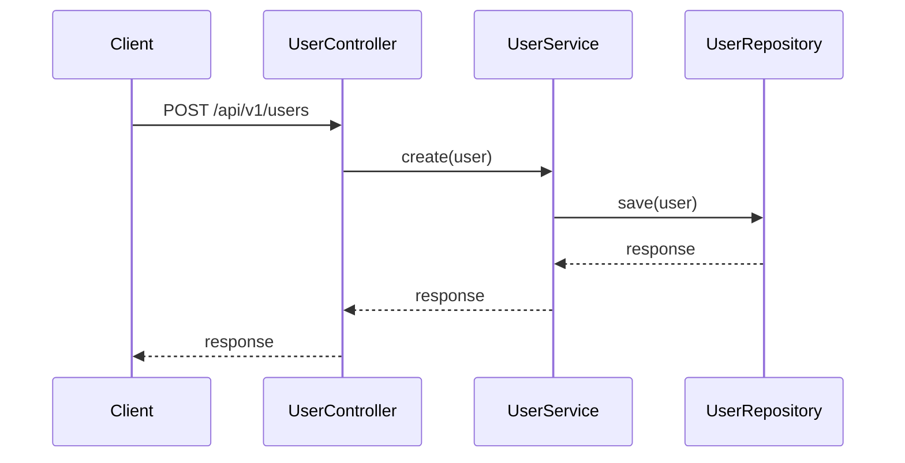
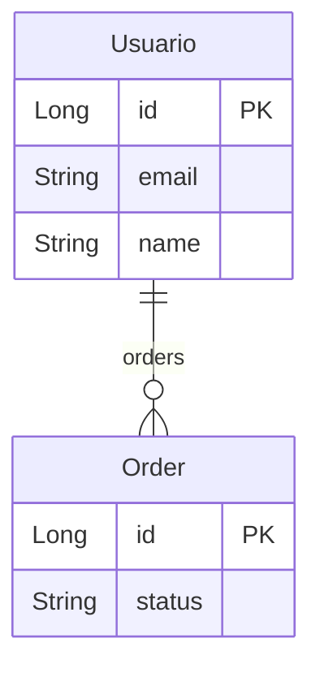
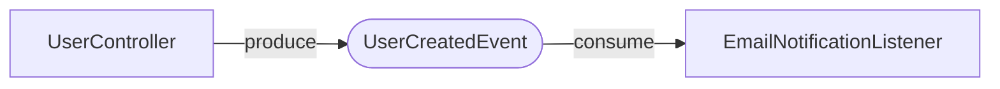

# JDocusaurus

Libreria Java para generar documentacion profunda de microservicios en formato [Docusaurus](https://docusaurus.io/), utilizando anotaciones y procesamiento en tiempo de compilacion (APT).

Anota tu codigo con `@JDoc*` y obtendras automaticamente: paginas Markdown con endpoints, diagramas de secuencia Mermaid, diagramas ER, mapa de eventos, reglas de negocio, integraciones externas, configuracion y una estructura Docusaurus lista para publicar.

## Caracteristicas

- **Zero runtime** - Solo annotation processing en tiempo de compilacion (`RetentionPolicy.SOURCE`)
- **Sin reflexion** - Funciona con Java puro, sin Spring ni frameworks
- **Diagramas Mermaid** automaticos: secuencia, ER, eventos, dependencias
- **Deteccion automatica de flujos** via analisis estatico con JavaParser
- **Lectura hibrida JPA** - Enriquece entidades con metadata JPA sin dependencia directa
- **Estructura Docusaurus completa** - `index.md`, `sidebars.js`, frontmatter con `sidebar_label` y `sidebar_position`
- **Configurable** via opciones de compilacion (`-Ajdoc.*`)

## Requisitos

- Java 21+
- Maven 3.8+

## Instalacion

Anade las dependencias a tu `pom.xml`:

```xml
<dependencies>
    <dependency>
        <groupId>org.aocdev</groupId>
        <artifactId>jdocusaurus-annotations</artifactId>
        <version>1.0-SNAPSHOT</version>
        <scope>provided</scope>
    </dependency>
    <dependency>
        <groupId>org.aocdev</groupId>
        <artifactId>jdocusaurus-processor</artifactId>
        <version>1.0-SNAPSHOT</version>
        <scope>provided</scope>
    </dependency>
</dependencies>
```

Opcionalmente configura las opciones del processor:

```xml
<build>
    <plugins>
        <plugin>
            <groupId>org.apache.maven.plugins</groupId>
            <artifactId>maven-compiler-plugin</artifactId>
            <version>3.13.0</version>
            <configuration>
                <compilerArgs>
                    <arg>-Ajdoc.projectName=User Service</arg>
                    <arg>-Ajdoc.projectDescription=Microservicio de gestion de usuarios</arg>
                    <arg>-Ajdoc.fullStructure=true</arg>
                </compilerArgs>
            </configuration>
        </plugin>
    </plugins>
</build>
```

## Inicio rapido

### 1. Documenta un controlador

```java
@JDocClass(
    name = "User Controller",
    description = "Controlador para la gestion de usuarios",
    basePath = "/api/v1/users",
    version = "v1"
)
public class UserController {

    @JDocEndpoint(
        method = HttpMethod.GET,
        path = "/{id}",
        description = "Obtiene un usuario por su ID",
        summary = "Obtener usuario"
    )
    @JDocResponse(code = 200, description = "Usuario encontrado")
    @JDocResponse(code = 404, description = "Usuario no encontrado")
    public Object getUserById(
            @JDocParam(
                name = "id",
                description = "Identificador del usuario",
                location = ParamLocation.PATH,
                example = "123"
            ) Long id
    ) {
        return userService.findById(id);
    }
}
```

### 2. Compila

```bash
mvn clean compile
```

### 3. Resultado

```
JDocusaurus: generados 16 ficheros (1 clases, 5 endpoints, 5 diagramas, ...)
```

Los ficheros Markdown se generan en `target/classes/docs/` (ruta por defecto).

## Anotaciones

### API REST

| Anotacion | Target | Descripcion |
|-----------|--------|-------------|
| `@JDocClass` | `TYPE` | Documenta un controlador/clase de API |
| `@JDocEndpoint` | `METHOD` | Documenta un endpoint HTTP |
| `@JDocParam` | `PARAMETER` | Documenta un parametro de un endpoint |
| `@JDocResponse` | `METHOD` | Documenta una respuesta HTTP (repetible) |
| `@JDocHeader` | `METHOD` | Documenta un header HTTP (repetible) |

```java
@JDocClass(name = "User Controller", description = "...", basePath = "/api/v1/users")
public class UserController {

    @JDocEndpoint(method = HttpMethod.POST, path = "/", description = "Crea un usuario", auth = "Bearer JWT")
    @JDocResponse(code = 201, description = "Creado")
    @JDocResponse(code = 400, description = "Datos invalidos")
    @JDocHeader(name = "Authorization", description = "Token JWT")
    public Object create(@JDocParam(description = "Datos del usuario", location = ParamLocation.BODY) Object user) {
        // ...
    }
}
```

### Flujos y diagramas de secuencia

| Anotacion | Target | Descripcion |
|-----------|--------|-------------|
| `@JDocFlow` | `TYPE`, `METHOD` | Declara un flujo de negocio |
| `@JDocFlowStep` | `METHOD` | Define un paso dentro de un flujo (repetible) |
| `@JDocParticipant` | `TYPE` | Declara un participante en diagramas de secuencia |

Los diagramas de secuencia se generan de dos formas:

**Manual** - Con `@JDocFlowStep`:

```java
@JDocFlow(name = "user-registration", title = "Registro de Usuario", description = "Flujo de registro")
public class UserController {

    @JDocFlowStep(flow = "user-registration", order = 1, from = "Client", to = "Controller", message = "POST /users")
    @JDocFlowStep(flow = "user-registration", order = 2, from = "Controller", to = "Service", message = "create(user)")
    @JDocFlowStep(flow = "user-registration", order = 3, from = "Service", to = "DB", message = "save(user)", returnMessage = "savedUser")
    public Object createUser(Object user) { ... }
}
```

**Automatico** - JavaParser analiza el codigo fuente y detecta las llamadas a metodos de campos inyectados, generando el diagrama automaticamente (recursivo, con deteccion de ramas condicionales).

Resultado Mermaid:



### Modelo de datos

| Anotacion | Target | Descripcion |
|-----------|--------|-------------|
| `@JDocEntity` | `TYPE` | Documenta una entidad de datos |
| `@JDocField` | `FIELD` | Documenta un campo de la entidad |
| `@JDocRelation` | `FIELD` | Documenta una relacion entre entidades |

Si la entidad tiene anotaciones JPA (`@Entity`, `@Column`, `@Id`, `@OneToMany`...), JDocusaurus las lee como fallback sin requerir JPA como dependencia. Las anotaciones `@JDoc*` siempre tienen prioridad.

```java
@JDocEntity(name = "Usuario", description = "Usuario registrado en el sistema", table = "users")
public class UserEntity {

    @JDocField(description = "Identificador unico", nullable = false, constraints = "PK, AUTO_INCREMENT")
    private Long id;

    @JDocField(description = "Email del usuario", example = "juan@example.com", nullable = false, constraints = "UNIQUE")
    private String email;

    @JDocRelation(target = "Order", type = RelationType.ONE_TO_MANY, description = "Pedidos del usuario")
    private List<Order> orders;
}
```

Genera un diagrama ER Mermaid:



### Eventos y mensajeria

| Anotacion | Target | Descripcion |
|-----------|--------|-------------|
| `@JDocEvent` | `TYPE` | Declara un evento de dominio |
| `@JDocProduces` | `METHOD`, `TYPE` | Marca un productor de eventos (repetible) |
| `@JDocConsumes` | `METHOD`, `TYPE` | Marca un consumidor de eventos (repetible) |

```java
@JDocEvent(
    name = "UserCreatedEvent",
    description = "Evento emitido al crear un usuario",
    topic = "user.created",
    schema = "{ \"userId\": \"long\", \"email\": \"string\" }"
)
public class UserCreatedEvent { }

// En el controlador:
@JDocProduces(event = UserCreatedEvent.class, topic = "user.created", description = "Emite evento al crear usuario")
public Object createUser(Object user) { ... }

// En el listener:
@JDocConsumes(event = UserCreatedEvent.class, description = "Envia email de bienvenida", group = "email-group")
public class EmailNotificationListener { }
```

Genera un mapa de eventos Mermaid:



### Reglas de negocio

| Anotacion | Target | Descripcion |
|-----------|--------|-------------|
| `@JDocBusinessRule` | `METHOD`, `TYPE` | Documenta una regla de negocio (repetible) |

```java
@JDocBusinessRule(id = "BR-001", rule = "El email debe ser unico en el sistema", severity = RuleSeverity.MANDATORY)
@JDocBusinessRule(id = "BR-002", rule = "La contrasena debe tener minimo 8 caracteres", severity = RuleSeverity.MANDATORY, relatedRules = {"BR-001"})
public Object create(Object user) { ... }
```

Las reglas se agrupan por severidad: `MANDATORY`, `WARNING`, `INFO`.

### Integraciones externas

| Anotacion | Target | Descripcion |
|-----------|--------|-------------|
| `@JDocExternalService` | `TYPE`, `FIELD` | Documenta un servicio externo |

```java
@JDocExternalService(
    name = "Payment Gateway",
    description = "Pasarela de pagos (Stripe)",
    type = ServiceType.REST,
    url = "https://api.stripe.com/v1",
    owner = "Team Payments"
)
public class PaymentGatewayClient { }
```

Genera un mapa de dependencias Mermaid con el servicio central y sus dependencias.

### Configuracion

| Anotacion | Target | Descripcion |
|-----------|--------|-------------|
| `@JDocConfig` | `FIELD`, `TYPE` | Documenta una propiedad de configuracion (repetible) |

```java
@JDocConfig(key = "payment.stripe.api-key", description = "API key de Stripe", required = true, secret = true)
@JDocConfig(key = "payment.timeout-ms", description = "Timeout en ms", defaultValue = "5000", example = "10000")
public class PaymentGatewayClient { }
```

Las propiedades marcadas como `secret = true` ocultan su valor con `***` en la documentacion generada.

## Opciones del processor

Configurables via `-Ajdoc.*` en `maven-compiler-plugin`:

| Opcion | Descripcion | Default |
|--------|-------------|---------|
| `jdoc.outputDir` | Directorio de salida (relativo o absoluto) | `docs` |
| `jdoc.fullStructure` | Genera `sidebars.js` para Docusaurus | `false` |
| `jdoc.projectName` | Nombre del proyecto (titulo de la pagina principal) | (nombre del primer controlador) |
| `jdoc.projectDescription` | Descripcion del proyecto | (vacio) |
| `jdoc.autoFlowDepth` | Profundidad maxima del analisis recursivo de JavaParser | `5` |
| `jdoc.autoFlowEnabled` | Activa/desactiva la deteccion automatica de flujos | `true` |

## Estructura generada

Con `jdoc.fullStructure=true`, se genera la siguiente estructura:

```
docs/
  index.md                    # Pagina principal con diagramas resumen
  sidebars.js                 # Sidebar para Docusaurus
  api/
    index.md                  # Indice de controladores y endpoints
    user-controller.md        # Documentacion por controlador
  flows/
    index.md                  # Indice de flujos
    user-registration.md      # Diagrama de secuencia por flujo
  data-model/
    index.md                  # Diagrama ER global + tabla de entidades
    user-entity.md            # Campos y relaciones por entidad
  events/
    index.md                  # Mapa de eventos + tabla resumen
    user-created-event.md     # Productores/consumidores por evento
  business-rules/
    index.md                  # Reglas agrupadas por severidad
  integrations/
    index.md                  # Mapa de dependencias + tabla de servicios
  config/
    index.md                  # Tabla de propiedades de configuracion
```

## Salida a ruta absoluta

Por defecto los ficheros se generan en `target/classes/docs/` via la API Filer del annotation processor. Si prefieres escribir directamente en una ruta absoluta (por ejemplo, el directorio `docs/` de tu proyecto Docusaurus), usa una ruta absoluta en `jdoc.outputDir`:

```xml
<arg>-Ajdoc.outputDir=/home/user/my-project/docs</arg>
```

- **Ruta relativa** (ej: `docs`): escribe via Filer en `target/classes/docs/`
- **Ruta absoluta** (ej: `/home/user/docs`): escribe directamente con `java.nio.file.Files`

Cuando usas ruta absoluta, los IDs del sidebar generado omiten el prefijo del directorio, ya que los ficheros se encuentran en la raiz de los docs de Docusaurus.

## Integracion con Docusaurus

1. Copia el directorio `target/classes/docs/` a tu proyecto Docusaurus (o usa una ruta absoluta para generar directamente en el destino)
2. Si usaste `jdoc.fullStructure=true`, copia `sidebars.js` a la raiz del proyecto
3. Instala el plugin de Mermaid para renderizar los diagramas:

```bash
npm install @docusaurus/theme-mermaid
```

En `docusaurus.config.js`:

```js
module.exports = {
  markdown: {
    mermaid: true,
  },
  themes: ['@docusaurus/theme-mermaid'],
};
```

## Estructura del proyecto

```
JDocusaurus/
  pom.xml                           # Parent POM (multi-modulo)
  jdocusaurus-annotations/          # Anotaciones @JDoc* y enums
    src/main/java/org/aocdev/jdocusaurus/annotations/
      api/                           # @JDocClass, @JDocEndpoint, @JDocParam, @JDocResponse, @JDocHeader
      flow/                          # @JDocFlow, @JDocFlowStep, @JDocParticipant
      data/                          # @JDocEntity, @JDocField, @JDocRelation
      event/                         # @JDocEvent, @JDocProduces, @JDocConsumes
      rule/                          # @JDocBusinessRule
      integration/                   # @JDocExternalService
      config/                        # @JDocConfig
      enums/                         # HttpMethod, ParamLocation, RelationType, RuleSeverity, ServiceType, ...
  jdocusaurus-processor/             # Annotation Processor + generadores
    src/main/java/org/aocdev/jdocusaurus/processor/
      config/                        # JDocusaurusConfig
      scanner/                       # AnnotationScanner, JavaParserScanner, JpaScanner
      generator/                     # DocWriter, MarkdownGenerator, MermaidGenerator, IndexGenerator, SidebarGenerator, ...
      model/                         # ClassModel, EndpointModel, EntityModel, EventModel, ...
  jdocusaurus-test/                  # Modulo de ejemplo y verificacion
```

## Build

```bash
mvn clean compile
```

La documentacion se genera automaticamente durante la compilacion del modulo que use las anotaciones. El output aparece en `target/classes/docs/` (o en la ruta absoluta si se configuro `jdoc.outputDir`).

## Licencia

MIT
